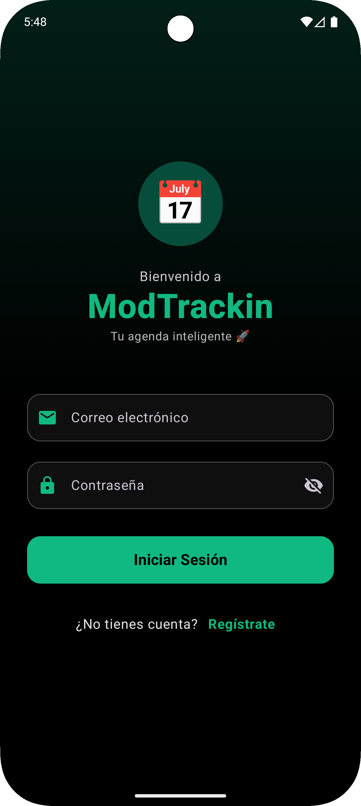
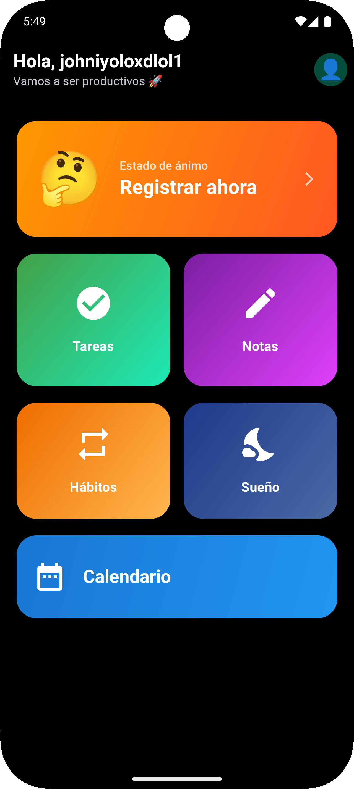
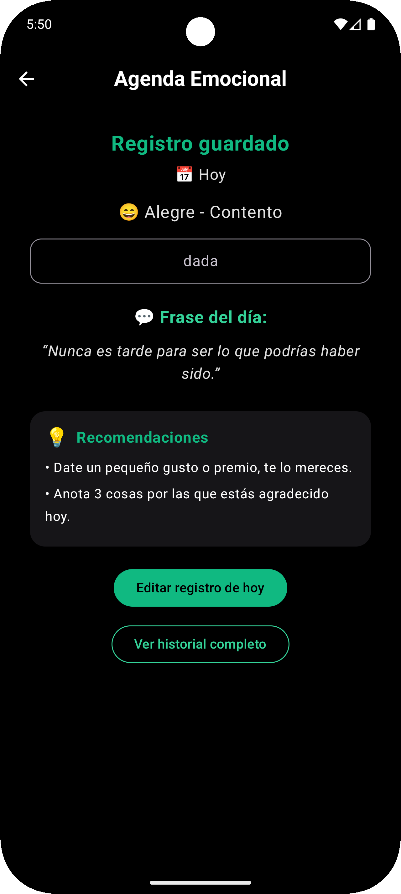
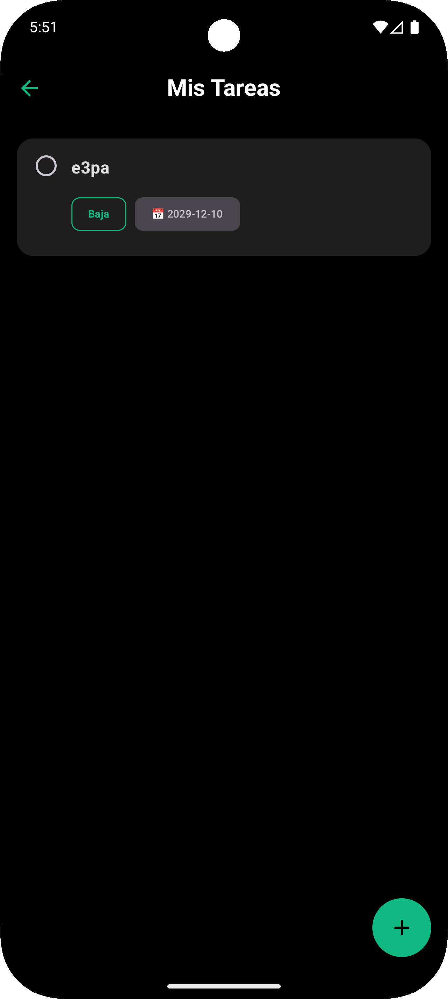
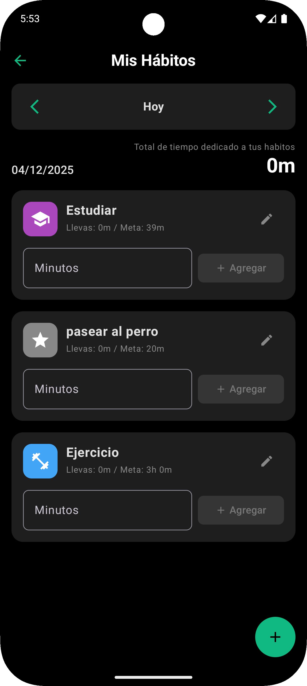

# 📱 ModTrackin: Agenda y Bienestar Personal con Firebase

## 🎯 Descripción del Proyecto

**ModTrackin** es una aplicación Android nativa desarrollada con **Kotlin** y **Jetpack Compose**. Su objetivo principal es ayudar a los usuarios a encontrar un equilibrio entre su productividad diaria y su salud mental, centralizando la gestión de tareas y hábitos junto con un registro consciente de emociones y ciclos de sueño.

El proyecto implementa una arquitectura moderna **MVVM (Model-View-ViewModel)** y utiliza **Firebase** como backend robusto para la autenticación segura y la sincronización de datos en la nube en tiempo real.

---

### 🌟 Características Principales

#### 🧠 Módulo de Bienestar
- ✅ **Agenda Emocional Interactiva:** Registro diario del estado de ánimo mediante emojis, selección de adjetivos y notas personales.
- ✅ **Feedback Inteligente:** Visualización de frases motivadoras y recomendaciones de actividades basadas en la emoción registrada.
- ✅ **Monitor de Sueño:** Registro preciso de horas de descanso con cálculo automático de duración y calidad.
- ✅ **Historial Visual:** Consulta cronológica de los registros emocionales pasados.

#### ⚡ Módulo de Productividad
- ✅ **Gestión de Tareas (To-Do):** Creación, edición y eliminación de tareas con prioridades (Alta/Media/Baja).
- ✅ **Seguimiento de Hábitos:** Monitoreo del progreso diario de hábitos con metas personalizadas.
- ✅ **Notas Rápidas:** Espacio dedicado para apuntes generales.
- ✅ **Notificaciones:** Sistema de recordatorios locales para no olvidar registrar actividades.

---

## 📸 Evidencias (Screenshots)

> Las capturas se encuentran en la carpeta `docs/screenshots`.

| Login y Registro | Dashboard Principal |
|:---:|:---:|
|  |  |

| Agenda Emocional | Gestión de Tareas |
|:---:|:---:|
|  |  |

| Hábitos |
|:---:|
|  | 


## 🏗️ Arquitectura del Proyecto

Este proyecto sigue estrictamente el patrón de diseño **MVVM** para asegurar un código limpio, escalable y fácil de mantener.

### 📐 Diagrama de Arquitectura

El flujo de datos viaja de manera reactiva desde la nube hasta la interfaz de usuario:

```text
+-------------------------------+
|         VIEW (UI)             |
|  (Pantallas Jetpack Compose)  |
+---------------+---------------+
                ^
                | (Observa UiState)
                v
+---------------+---------------+
|         VIEWMODEL             |
|    (Lógica de Negocio)        |
+---------------+---------------+
                ^
                | (Coroutines)
                v
+---------------+---------------+
|        REPOSITORY             |
|     (Fuente de Verdad)        |
+---------------+---------------+
                ^
                | (Internet)
                v
+---------------+---------------+
|         FIREBASE              |
|     (Cloud Firestore)         |
+-------------------------------+
```
## 🛠️ Tecnologías y Herramientas

Este proyecto utiliza un stack tecnológico moderno centrado en el ecosistema nativo de Android y la nube de Google:

* **Kotlin:** Lenguaje de programación principal utilizado en el 100% del proyecto.
* **Jetpack Compose:** Toolkit moderno para construir interfaces de usuario nativas de forma declarativa (Material Design 3).
* **MVVM (Model-View-ViewModel):** Patrón de arquitectura utilizado para desacoplar la lógica de negocio de la interfaz de usuario.
* **Firebase Auth:** Servicio para la gestión segura de autenticación (inicio de sesión y registro).
* **Firebase Firestore:** Base de datos NoSQL en la nube para la persistencia y sincronización de datos en tiempo real.
* **Coroutines & Flow:** Librerías para el manejo eficiente de operaciones asíncronas y flujos de datos reactivos.
* **AlarmManager:** Servicio del sistema utilizado para programar notificaciones y recordatorios locales.
* **KDoc:** Estándar de documentación técnica implementado en todo el código fuente.

## ⚙️ Instalación y Configuración

Sigue estos pasos para ejecutar el proyecto en tu entorno local.

### Requisitos Previos

* **Android Studio:** Versión recomendada Koala o superior.
* **JDK:** Versión 17 o superior.
* **Cuenta de Google:** Necesaria para configurar la consola de Firebase.

### PASO 1: Clonar el Repositorio

Abre tu terminal y ejecuta el siguiente comando para descargar el código fuente:

git clone https://github.com/Juan-OM9/MoodTracking

### PASO 2: Configurar Firebase (⚠️ IMPORTANTE)
Este proyecto utiliza servicios de Google que requieren un archivo de configuración (google-services.json) que no se incluye en el repositorio por razones de seguridad. Debes generar el tuyo propio:

Ve a la Consola de Firebase y crea un nuevo proyecto.

Agrega una aplicación Android al proyecto.

Ingresa el nombre del paquete de la aplicación: mx.edu.utng.modtrackin

Descarga el archivo google-services.json que te proporciona Firebase.

Mueve ese archivo a la carpeta app dentro de tu proyecto.

Ruta final: ModTrackin/app/google-services.json

En la consola de Firebase, habilita los siguientes servicios:

Authentication: Activa el proveedor de "Correo electrónico/Contraseña".

Firestore Database: Crea una base de datos (puedes iniciar en "modo prueba" para desarrollo).

### PASO 3: Ejecutar la Aplicación
Abre Android Studio.

Selecciona File > Open y busca la carpeta del proyecto clonado.

Espera a que Gradle termine de sincronizar las dependencias (puede tardar unos minutos la primera vez).

Conecta tu dispositivo Android o inicia un emulador (API 26+ recomendada).

Haz clic en el botón Run (▶️) en la barra de herramientas.

## 📁 Estructura del Proyecto

El código fuente está organizado siguiendo el principio de separación de responsabilidades, dividiendo la aplicación en capas lógicas claras:

```text
mx.edu.utng.modtrackin
├── 📦 data                  # Capa de Datos
│   ├── model                # Clases de datos (Data Classes) que definen la estructura de la información (Task, Habit, EmotionEntry, User).
│   └── repository           # Clases encargadas de la comunicación directa con Firebase Firestore y la abstracción de datos.
│
├── 🧭 navigation            # Configuración de la navegación
│   ├── NavRoutes.kt         # Definición de constantes para las rutas de navegación.
│   └── AppNavigation.kt     # Grafo de navegación (NavHost) que conecta todas las pantallas.
│
├── 🎨 ui                    # Capa de Presentación (Interfaz de Usuario)
│   ├── screens              # Pantallas Composable (Vistas)
│   │   ├── calendar         # Vista de calendario mensual.
│   │   ├── emotions         # Flujo de registro emocional.
│   │   ├── habits           # Seguimiento y edición de hábitos.
│   │   ├── home             # Dashboard principal.
│   │   ├── login            # Pantalla de inicio de sesión.
│   │   ├── notes            # Listado y editor de notas.
│   │   ├── register         # Pantalla de registro de usuarios.
│   │   ├── sleep            # Monitor de sueño.
│   │   └── tasks            # Gestión de tareas pendientes.
│   ├── theme                # Definiciones de diseño (Colores, Tipografía, Formas).
│   └── viewmodel            # ViewModels que gestionan el estado de la UI y la lógica de negocio.
│
└── 🛠️ utils                 # Utilidades y Herramientas
    ├── AppNotificationManager.kt # Gestión de notificaciones del sistema.
    ├── NotificationHelper.kt     # Configuración del canal de notificaciones.
    ├── NotificationReceiver.kt   # BroadcastReceiver para alarmas.
    └── NotificationScheduler.kt  # Programador de alarmas con AlarmManager.

```
  
### Ejemplo 1: Modelo de Datos (Task.kt)
Este ejemplo muestra cómo documentar una data class, explicando qué representa la entidad y el propósito de cada propiedad, incluyendo las anotaciones específicas de Firebase.

Kotlin

package mx.edu.utng.modtrackin.data.model

import com.google.firebase.firestore.PropertyName
import com.google.firebase.firestore.ServerTimestamp
import java.util.Date

/**
 * Clase de modelo de datos (data class) que representa una tarea o elemento pendiente (To-Do).
 *
 * Actúa como un objeto de transferencia de datos (DTO) entre la base de datos Firestore y la UI de la aplicación.
 *
 * @property id El identificador único del documento en Firestore.
 * @property userId El ID del usuario propietario de la tarea (para filtrado de seguridad).
 * @property title El título o encabezado principal de la tarea.
 * @property description Detalles adicionales o notas sobre la tarea.
 * @property category La categoría a la que pertenece (ej. "Trabajo", "Personal").
 * @property priority El nivel de urgencia de la tarea (ej. "Alta", "Media", "Baja").
 * @property isCompleted Indica si la tarea ha sido finalizada. Mapeado manualmente con [PropertyName] para evitar conflictos de serialización.
 * @property createdAt Marca de tiempo del servidor ([ServerTimestamp]) que registra cuándo se creó la tarea.
 * @property dueDate Fecha de vencimiento en formato String (YYYY-MM-DD).
 * @property reminder Hora del recordatorio configurado.
 */
data class Task(
    var id: String = "",
    val userId: String = "",
    val title: String = "",
    val description: String = "",
    val category: String = "",
    val priority: String = "Baja",

    @get:PropertyName("isCompleted")
    @set:PropertyName("isCompleted")
    var isCompleted: Boolean = false,

    @ServerTimestamp
    val createdAt: Date? = null,
    val dueDate: String = "",
    val reminder: String = ""
)

### Ejemplo 2: ViewModel (TaskViewModel.kt)
Este ejemplo muestra cómo documentar una clase de lógica de negocio, explicando sus responsabilidades, el manejo de estado y lo que hace cada función crítica.

Kotlin

package mx.edu.utng.modtrackin.ui.viewmodel

import androidx.lifecycle.ViewModel
import androidx.lifecycle.viewModelScope
import kotlinx.coroutines.launch
import mx.edu.utng.modtrackin.data.model.Task
import mx.edu.utng.modtrackin.data.repository.TaskRepository

/**
 * ViewModel encargado de gestionar la lógica de negocio y el estado de la pantalla de Tareas.
 *
 * Sus responsabilidades principales incluyen:
 * 1. Sincronizar la lista de tareas en tiempo real con [TaskRepository].
 * 2. Gestionar el ciclo de vida de las tareas (creación, edición, eliminación).
 * 3. Controlar la visibilidad y el estado del formulario de edición.
 *
 * @property uiState Estado observable de la UI que contiene la lista de tareas, indicadores de carga y mensajes de error.
 */
class TaskViewModel : ViewModel() {

    // ... (Propiedades de estado) ...

    /**
     * Valida los datos del formulario y guarda la tarea en el repositorio.
     *
     * Si el ID de la tarea está vacío, se crea una nueva; si ya existe, se actualiza.
     * Requiere que el título no esté en blanco.
     *
     * @see TaskRepository.saveTask
     */
    fun saveTask() {
        if (uiState.title.isBlank()) {
            uiState = uiState.copy(errorMessage = "El título es obligatorio")
            return
        }

        viewModelScope.launch {
            uiState = uiState.copy(isLoading = true)
            // Lógica de mapeo y guardado...
            val result = repository.saveTask(taskToSave)
            if (result.isSuccess) {
                closeEditor()
            } else {
                uiState = uiState.copy(isLoading = false, errorMessage = result.exceptionOrNull()?.message)
            }
        }
    }

    /**
     * Alterna el estado de finalización de una tarea específica.
     *
     * Invierte el valor de `isCompleted` y guarda el cambio inmediatamente en la base de datos.
     *
     * @param task La tarea cuyo estado se desea modificar.
     */
    fun toggleTaskCompletion(task: Task) {
        viewModelScope.launch {
            val updatedTask = task.copy(isCompleted = !task.isCompleted)
            repository.saveTask(updatedTask)
        }
    }
}

### Ejemplo 3: Screen (TasksScreen.kt)
Este ejemplo ilustra cómo se estructura una pantalla en Compose utilizando el patrón de "State Hoisting" (elevación de estado) y documentación KDoc para describir los componentes visuales.

package mx.edu.utng.modtrackin.ui.screens.tasks

import androidx.compose.runtime.Composable
import androidx.lifecycle.viewmodel.compose.viewModel
import androidx.navigation.NavController
import mx.edu.utng.modtrackin.data.model.Task
import mx.edu.utng.modtrackin.ui.viewmodel.TaskViewModel

/**
 * Punto de entrada principal para la sección de gestión de Tareas.
 *
 * Actúa como un orquestador que decide qué pantalla mostrar basándose en el estado
 * del ViewModel: la lista de tareas o el editor.
 *
 * @param navController Controlador de navegación.
 * @param taskViewModel ViewModel que provee el estado [TaskUiState].
 */
@Composable
fun TasksScreen(
    navController: NavController,
    taskViewModel: TaskViewModel = viewModel()
) {
    val uiState = taskViewModel.uiState

    if (uiState.isEditorOpen) {
        TaskEditorScreen(taskViewModel = taskViewModel)
    } else {
        TasksListScreen(
            uiState = uiState,
            onAddClick = { taskViewModel.openEditorNew() },
            onEditClick = { task -> taskViewModel.openEditorModify(task) },
            onToggleComplete = { task -> taskViewModel.toggleTaskCompletion(task) },
            onBack = { navController.popBackStack() }
        )
    }
}

/**
 * Pantalla que renderiza el listado de tareas.
 *
 * Utiliza un [Scaffold] para la estructura básica y [LazyColumn] para la lista eficiente.
 *
 * @param uiState Estado actual de la UI (lista, carga, errores).
 * @param onAddClick Evento para crear nueva tarea.
 * @param onEditClick Evento al seleccionar una tarea.
 * @param onToggleComplete Evento al marcar el checkbox.
 */
@Composable
fun TasksListScreen(
    uiState: TaskUiState,
    onAddClick: () -> Unit,
    onEditClick: (Task) -> Unit,
    onToggleComplete: (Task) -> Unit,
    onBack: () -> Unit
) {
    Scaffold(
        floatingActionButton = {
            FloatingActionButton(onClick = onAddClick) {
                Icon(Icons.Default.Add, contentDescription = "Nueva Tarea")
            }
        }
    ) { padding ->
        if (uiState.taskList.isEmpty()) {
            Box(contentAlignment = Alignment.Center, modifier = Modifier.fillMaxSize()) {
                Text("No hay tareas pendientes \uD83D\uDCC3")
            }
        } else {
            LazyColumn(contentPadding = PaddingValues(16.dp)) {
                items(uiState.taskList, key = { it.id }) { task ->
                    TaskCard(
                        task = task,
                        onToggleComplete = { onToggleComplete(task) },
                        onClick = { onEditClick(task) }
                    )
                }
            }
        }
    }
}

### 🧑‍💻 Autores

Juan Gilberto Mejia Ortiz y Halan Fernando Rodriguez Guerrero
Institución: Universidad Tecnológica del Norte de Guanajuato (UTNG)
Materia: Desarrollo de Aplicaciones Móviles
